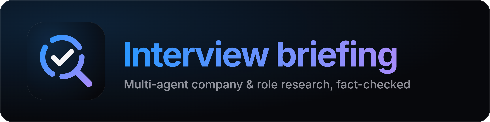

<p align="center">
  
</p>

# Multi-Agent Company & Role Research Assistant

Give it a company name and a job posting. Three collaborating AI agents — a
Researcher, an Editor, and a Writer — turn that into a structured interview
briefing: what's confirmed, what's sourced straight from the posting, and
what couldn't be verified, so you know exactly what to double-check before
an interview.

Built for my own job search, and as a portfolio piece demonstrating
multi-agent orchestration, independent fact-checking, and honest
self-evaluation — not just an LLM wrapped in a prompt.

**[Live demo](#)** · **[Architecture diagram](#)** *(links added at deploy)*

---

## What makes this different from "call an LLM and print the answer"

Most AI demo projects are a single model call with a system prompt. This one
has three separate agents that check each other's work, and — the part most
portfolio projects skip — a verification step that's actually adversarial to
its own pipeline: the Editor doesn't just re-read the Researcher's claims,
it independently re-searches to confirm them, and it's specifically
forbidden from marking something "verified" unless every detail in the
claim is actually confirmed, not just the gist.

The project also includes a real evaluation of its own accuracy (below),
including places it gets things wrong — which is a rarer thing to publish
than a demo that only shows the good runs.

## Architecture

```
Company name + job posting
            │
            ▼
   1 · Researcher ──── Tavily search, concurrent queries, up to 3 passes
            │           thin-category detection is a deterministic count,
            │           not a model guess
            ▼
   2 · Editor ───────── Chain-of-Verification: 8 independently-searched
            │           checks per round, run concurrently, each fully
            │           isolated from the others
            │           statuses: verified · contradicted · unverified ·
            │           off_target · from_posting
            │           auto sends back to the Researcher if quality < 7/10
            ▼
   3 · Human approval ─ pause point (LangGraph interrupt()) — review the
            │           verified findings, approve or send back with a note
            ▼
   4 · Writer ───────── structured JSON → briefing, with hedged, varied
                        phrasing for unverified claims

Every LLM call goes through one shared helper:
  Claude Sonnet 5 (primary) → NVIDIA NIM (fallback on rate-limit / credit errors)
```

A full architecture diagram (including the API layer and the Streamlit UI's
four screens) is published [here](#) *(artifact link added at deploy)*.

## Tech stack

| Layer | Choice |
|---|---|
| Orchestration | LangGraph (typed shared state, checkpointing, `interrupt()` for human-in-the-loop) |
| LLM | Claude Sonnet 5, with NVIDIA NIM (Nemotron) as an automatic fallback |
| Web search | Tavily |
| Backend | FastAPI, Server-Sent Events for live progress streaming |
| Checkpointer | SQLite (local dev) / Postgres (`DATABASE_URL` set) |
| Frontend | Streamlit |
| Evaluation | Claude Opus 5 as an independent judge, plus DeepEval faithfulness/consistency scoring |

## Running it

```bash
git clone <repo-url>
cd <repo>
python -m venv .venv && source .venv/bin/activate   # .venv\Scripts\activate on Windows
pip install -r requirements.txt

cp .env.example .env
# fill in ANTHROPIC_API_KEY, TAVILY_API_KEY, and (optional) NVIDIA_API_KEY

# terminal 1
python -m uvicorn api:app --port 8000

# terminal 2
streamlit run app.py
```

Or run the pipeline standalone from the command line, no UI:

```bash
python main.py "Company Name" path/to/posting.txt
```

## Deploying it (free)

[`render.yaml`](render.yaml) sets up the API and the UI as two free Render web services (New > Blueprint), with
a free [Neon](https://neon.tech) Postgres for run checkpoints and the daily usage counts. Render asks for the
secrets in its dashboard: `ANTHROPIC_API_KEY`, `TAVILY_API_KEY`, `DATABASE_URL`, and the API's public address as
the UI's `API_URL`; it generates `API_TOKEN` and copies it to the UI. Set a monthly spend limit in the Anthropic
console too: it's the one hard stop on cost. Free services sleep after 15 idle minutes, so the first visit after a
quiet spell takes about a minute.

What protects the public demo: the API refuses to start on Render without `API_TOKEN` and accepts only the UI's
token; daily caps for the whole demo and per visitor are kept in Postgres, so a restart can't reset them; inputs are
size-capped, cleaned of control characters, and fenced off as data inside the prompts; visitors never see
tracebacks or API docs.

## Evaluation

Full methodology, per-claim data, and scoring code are in [`evals/`](evals/). The scoring libraries are
eval-only, so they have their own install: `pip install -r evals/requirements.txt`.
**Coverage is small — 2 of 6 planned companies, one live run each**, scored
by an independent Claude Opus 5 judge doing its own fresh web searches. Cut
short by API budget; treat these as signals about how the system fails, not
as statistically reliable rates.

| | Sony Play Station | CaseGuard |
|---|---|---|
| Claims (verified / unverified / contradicted / from posting / off-target) | 2 / 27 / 0 / 4 / 3 | 5 / 24 / 1 / 0 / 0 |
| Verified-label precision (independent re-check) | 2/2 | 5/5 |
| Never-checked claims the judge could confirm (sample of 5) | 1/5 | 5/5 |
| Checked-but-inconclusive claims the judge also couldn't confirm | 4/6 | 1/2 |
| From-posting label precision | 3/4 | n/a |
| Report faithfulness / consistency | 0.97 / 0.97 | 1.00 / 1.00 |
| Unverified claims stated as fact in the report | 1 | 2 |

In both runs most claims went unchecked (21 and 22). Sony's unchecked pile
included 2 wrong claims out of 5 sampled; CaseGuard's had none out of 5.
Both kinds are labeled 'unverified' identically.

## Known limitations

These come from the Phase 4 evals above. Sample size is small (2 companies,
one live run each) — treat the numbers as signals, not rates.

**"Verified" means the source says it, not that it's true — a deliberate
scope decision.** Independently establishing ground truth is a much harder
problem than verifying source attribution, and pretending otherwise would
be worse than being upfront about the boundary. A claim is verified when
its own independent check finds a source stating it; if that source is a
third-party estimate, the estimate gets verified. In the CaseGuard run,
three verified claims disagree with each other: 11–50 employees, about 57
employees, and revenue of both $4.1M and $6M — each matches the site it
came from. In the fixed test set, LeadIQ's "8.3K employees" for Sony
Interactive Entertainment is true to its source but most likely wrong, and
the independent judge made the same mistake and supported it. The practical
implication: treat "verified" as "a real source says this," and use your
own judgment on numeric specifics that could be stale or disputed.

**Most unverified claims are never checked.** The Editor checks at most 8
claims per run (`MAX_VERIFICATION_QUESTIONS` in `graph.py`). In the
CaseGuard run, 22 of 24 unverified claims were never checked, and the judge
confirmed all 5 it sampled — many "unverified" claims are simply unchecked,
not actually doubtful. It cuts both ways: in the Sony run, 2 of 5 sampled
never-checked claims were independently found to be wrong. Both cases are
labeled "unverified" identically in the report, with no way to tell which
kind you're looking at.

**Reworded duplicates aren't merged.** The Researcher only removes exact-text
repeats. The Editor is asked to merge paraphrases in its prompt, but in a
replay of a past run, both copies of a known duplicate pair stayed. Each
copy is judged on its own check, so one copy can't be falsely verified off
the other's check — but both still appear in the briefing, which is
redundant, not incorrect.

**Posting attribution is a word-overlap heuristic.** A claim is attributed
to the job posting when enough of its wording appears in the posting
(`POSTING_MATCH = 0.65`). On 106 hand-labeled claims from runs after the
rule was added, it was right 92% of the time when it attributed a claim,
and caught 96% of the claims that really came from the posting. Misses
cluster near the cutoff — a different posting from the same company, sharing
boilerplate language, is the hardest case for word matching to get right.

**The strongest three labels are enforced in code, live-tested only on
single claims.** A claim can be labeled verified, from-the-posting, or
contradicted only if:
- **verified** — its own check confirmed every detail it states;
- **from the posting** — every detail appears in the posting;
- **contradicted** — its check found a genuinely conflicting value, not
  just a less precise one (a source saying "30+" doesn't contradict a claim
  of "33").

Otherwise the claim becomes unverified. The live check of the last two
rules replayed just the Editor's review on one claim at a time, 3 runs
each, and all 6 came out correctly enforced. A full review, where the
Editor weighs around 30 claims at once, hasn't been live-tested with these
specific rules.

**A downgraded claim doesn't always explain why.** When the Editor marks a
claim unverified, it records the discrepancy in a structured field, but the
human-readable note can come back empty (observed in 2 of 3 CaseGuard
replays). The approval screen currently shows only the note, so a reviewer
may not see the specific gap (e.g. "33 vs. 30+") that caused the downgrade.
A claim downgraded out of "from the posting" also loses its citation
entirely: the Researcher had a web link for it, but removed that link when
it attributed the claim to the posting.

**The NVIDIA fallback isn't visible in the app.** If Claude is rate-limited
or the account runs out of credits, calls automatically fall back to NVIDIA
NIM (Nemotron). Every answer's provider is recorded in the trace, and the
evals exclude anything NIM touched from scoring — but the Streamlit UI
itself doesn't currently show the reviewer which provider answered.

**The quick check reports what public search shows, not the full record.**
It checks H-1B history on USCIS's H-1B Employer Data Hub and on sites that
republish Department of Labor LCA filings; the Department's own bulk data
isn't searchable, and the republishing sites lag by months. A "yes" must
quote a search result word for word or it's downgraded to "couldn't
determine", but a same-name company can still slip past the name check, and
"no history found" doesn't prove a company has never sponsored. It was tested
offline only, not against live searches.

**Eval implementation notes.**
- DeepEval 4.x's hallucination metric means the opposite of what its name
  suggests as of this version — a score of 1 means *no* contradictions
  found. The results table above labels this "Report consistency" instead
  to avoid the confusion.
- The eval's cost cap (`EVAL_BUDGET_USD`) is checked after each API call
  completes, so a capped run can overshoot the limit by one call.

## What's next

- Expand eval coverage past 2 companies as budget allows.
- Surface which provider (Claude vs. NIM) answered each part of a run in
  the UI, not just the trace.
- Typst-based PDF export (currently markdown download only).
- Merge reworded duplicate claims before they reach the Editor.

---

© 2026 Ayush Jaiswal. All rights reserved.
